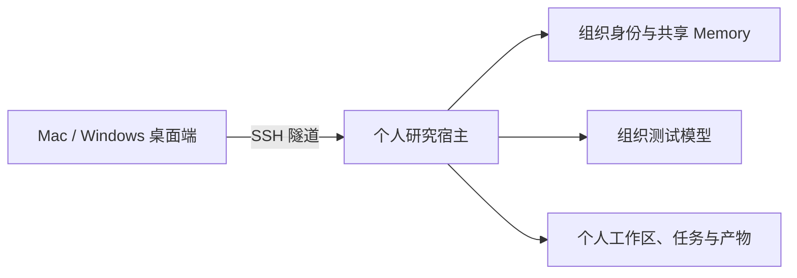

# QuantCode Test V1.0

QuantCode 是 HKUST QUANT SOCIETY 的团队研究与开发 Agent。因子、模型、风控、基本面、策略、期权、基建和 Agent 组使用同一套桌面端与执行器，身份、个人工作区、工具和 Memory 按组织授权隔离。

[下载 Test V1.0](https://github.com/HKUST-QUANT-SOCIETY/quantcode/releases/tag/quantcode-v1.0.0-test.1) · [构建状态](https://github.com/HKUST-QUANT-SOCIETY/quantcode/actions/workflows/quantcode-desktop.yml) · [功能规格](specs/FUNCTIONAL_SPEC.md) · [MIT License](LICENSE)

Test V1.0 的版本号为 `1.0.0-test.1`，属于内部测试预发布。Mac 和 Windows 安装包由 GitHub Actions 从同一提交构建，随包提供校验和及发布清单。测试包未做平台代码签名，自动更新关闭；它不是已签名的正式生产版本。

## 是否需要服务器

需要。桌面端是操作入口，研究任务在组织提供的个人研究宿主上执行；Server C 的常驻服务负责身份认证、组内 Memory、任务记录和产物。成员电脑不需要安装 Python、Bun、Node.js 或另一套 OpenCode。



每个成员有独立的系统账号、工作区、登录凭据和执行状态。关闭桌面窗口后可以重新连接查看服务器上的任务；需要停止执行时使用任务中的停止操作。退出登录会撤销当前登录会话。

## 下载和安装

从 [Test V1.0 Release](https://github.com/HKUST-QUANT-SOCIETY/quantcode/releases/tag/quantcode-v1.0.0-test.1) 下载与你电脑对应的文件，同时下载 `SHA256SUMS` 和 `release-manifest.json`。

| 电脑 | 安装文件 |
| --- | --- |
| Mac，Apple Silicon（M 系列） | `quantcode-1.0.0-test.1-mac-arm64.dmg` |
| Mac，Intel | `quantcode-1.0.0-test.1-mac-x64.dmg` |
| Windows 10/11，x64 | `quantcode-1.0.0-test.1-win-x64.exe` |

Mac 打开 DMG，将 QuantCode 拖到“应用程序”。Windows 运行 EXE，按提示安装到当前用户。

测试包可能触发 Gatekeeper 或 SmartScreen。先确认下载来自上述仓库且 SHA256 与发布清单一致，再按系统提示批准运行；不要关闭整个系统的安全保护。正式签名版与内部测试版的信任状态会分别写入发布清单。

校验命令：

```bash
# macOS，比较结果与 SHA256SUMS 中对应文件的一行
shasum -a 256 quantcode-1.0.0-test.1-mac-arm64.dmg
```

```powershell
# Windows PowerShell
Get-FileHash -Algorithm SHA256 .\quantcode-1.0.0-test.1-win-x64.exe
```

## 首次使用

成员只需准备组织已登记公钥对应的本地私钥，例如 `qc-chenzhenhong_ed25519`。A/B/C 服务器地址内置在应用中，无需填写 URL、端口或访问密码。

已有有效会话时，打开应用直接进入工作台。需要重新登录时，点击 **重新登录**：

1. **选择私钥文件**：系统文件选择器打开后选择本地私钥。应用从文件名解析 Linux 用户名；无法解析时询问一次，并按密钥记住答案。私钥加载到本机 SSH Agent，正文不会上传到服务器或模型。
2. **选择工作组**：应用依次探测 Server A/B/C，在可登录服务器上读取 `groups` 和本人私有连接信息。清单显示“组 × 服务器”；点击一项即完成组织认证并进入该服务器的工作区，无需再次选择服务器或点击进入按钮。

Linux 组用于发现和排序，组织名册补足并限制可选业务组。个人研究账号可以继续只拥有自己的 Linux 私有组，不需要扩大文件系统权限。账号、角色、业务组及工作目录均以服务端签发的身份为准。

应用自动维护 SSH 隧道。重开应用会恢复连接并检查已有会话；过期或撤销的会话要求重新登录，不会自动重新签发。未登记的服务器不参与登录，失败原因会在清单旁显示。

管理员需提前为成员开通个人研究宿主、登记公钥及名册权限，并在该成员服务器目录下下发 `~/.quantcode/test-v1/connection.json`。文件中的内部访问凭据由应用读取，成员无需手动配置。Windows 的系统 OpenSSH 和 SSH Agent 要求见 [平台安装说明](frontend/packages/desktop/QUANTCODE_INSTALL.md)。

完整链路及验证范围见 [登录流程与验证](docs/LOGIN_FLOW.md)。

Test V1.0 由组织预置统一测试模型。普通成员无需填写模型 Key；需要使用自己的供应商时，可在“模型供应商”中添加 URL、API Key 和模型，作为该个人研究宿主的一份模型配置。安装包不会内置组织模型密钥。

## 完成第一条任务

在“新建研究”选择自己的授权工作目录，确认模型可用后输入：

> 在当前个人工作区创建 hello_quantcode.md，内容为当前项目的简短说明。先查询能力目录和组内 Memory，说明计划改动的文件；需要我确认时先暂停，确认后再写入并读回核对。不要修改其他目录。

按界面中的“任务方案与能力复用”核对范围并填写确认说明。确认后点击 **继续执行**，不要把一段新的批准文字当作原任务的继续指令。

执行结束后，可以查看对话中的工具结果、执行记录、文件和产物。下载产物后仍可重新登录查看原任务。遇到未确认的写入回执，先核对实际文件或外部证据，不要重复执行写入。

## Test V1.0 的范围

已支持：SSH 身份与多公钥选择、个人工作区、组织模型配置、组内 Memory、能力目录、方案与复用审批、原生任务、文件修改、预算、停止、任务历史和产物。

各量化组件只有在对应服务、数据和授权已实际接通时才能使用。页面中的 `UNAVAILABLE`、`PARTIAL` 或未连接状态不表示业务已完成；Test V1.0 不承诺所有因子评估、训练、回测、风险和估值链路已经具备真实数据。普通成员不能部署到生产环境。

发布验证范围与限制见 [Test V1.0 验收摘要](docs/TEST_V1_ACCEPTANCE.md)。

## 常见问题

| 现象 | 检查方法 |
| --- | --- |
| 无法连接研究服务器 | 点击重新登录重建连接；若提示个人宿主尚未开通，由管理员检查成员的 connection.json 和服务状态 |
| 没有可选公钥 | 通过系统选择器选择已登记私钥；Windows 先确认 ssh-agent 服务已启动 |
| 登录身份或组不对 | 核对当前服务器和公钥；由管理员修改组织名册，不能通过提示词改组 |
| 提示选择 Agent 或模型 | 确认个人宿主的组织模型已配置；必要时刷新模型列表或联系管理员 |
| 确认后仍未执行 | 使用方案面板中的“继续执行”，检查预算、审批版本和错误提示 |
| Memory 为空 | 空结果可以正常使用；“未连接”需要修复服务连接，不能当作空知识库 |
| 超出预算或出现未知写入结果 | 停止并核对任务状态，不通过重新点击或更换身份绕过限制 |
| 更新版本 | 退出应用，下载同架构的新包并手动安装；测试版不自动更新 |

## 开发者

仅参与开发时需要源码环境。当前原生执行器、UI 和 Electron 都在本仓库；Python Runner 仅保留必要的历史兼容功能。

```bash
git clone https://github.com/HKUST-QUANT-SOCIETY/quantcode.git
cd quantcode
uv sync
bun run install:frontend
bun run dev:quantcode
# Electron 开发入口
bun run dev:desktop
```

研究宿主必须另外配置组织网关、名册、公钥、工作区与已审核工具目录。开发环境不自动获得组织成员权限，也不代表服务已部署。

| 内容 | 入口 |
| --- | --- |
| 产品需求 | [docs/PRD.md](docs/PRD.md) |
| 功能规格 | [specs/FUNCTIONAL_SPEC.md](specs/FUNCTIONAL_SPEC.md) |
| 技术设计 | [docs/QuantCode_Design.md](docs/QuantCode_Design.md) |
| UI 规格 | [docs/UI_DESIGN_SPEC.md](docs/UI_DESIGN_SPEC.md) |
| 仓库结构 | [docs/REPOSITORY_LAYOUT.md](docs/REPOSITORY_LAYOUT.md) |
| 发布与打包 | [QUANTCODE_RELEASE.md](frontend/packages/desktop/QUANTCODE_RELEASE.md) |
| 平台安装细节 | [QUANTCODE_INSTALL.md](frontend/packages/desktop/QUANTCODE_INSTALL.md) |

运行测试：

```bash
.venv/bin/pytest -q
cd frontend/packages/opencode
bun typecheck
bun --smol test --timeout 30000
```

## License 与来源

本项目采用 [MIT License](LICENSE)。桌面与执行器基于仓库内维护的 OpenCode 源码；部分 Memory、Checkpoint 和 Subagent 设计参考 MimoCode。原许可证、依赖声明与第三方 notices 随源码和安装包保留。

由 HKUST QUANT SOCIETY 维护。
