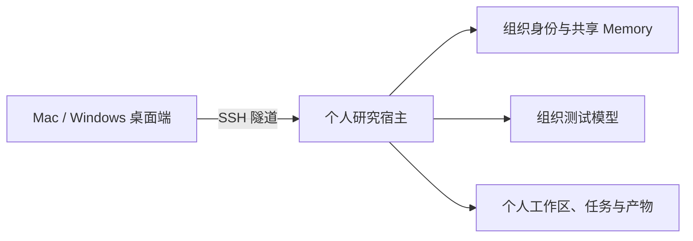

# QuantCode Test V1.0

QuantCode 是 HKUST QUANT SOCIETY 的团队研究与开发 Agent。因子、模型、风控、基本面、策略、期权、基建和 Agent 组使用同一套桌面端与执行器，身份、个人工作区、工具和 Memory 按组织授权隔离。

[下载 Test V1.0](https://github.com/HKUST-QUANT-SOCIETY/quantcode/releases/tag/quantcode-v1.0.0-test.1) · [构建状态](https://github.com/HKUST-QUANT-SOCIETY/quantcode/actions/workflows/quantcode-desktop.yml) · [功能规格](specs/FUNCTIONAL_SPEC.md) · [MIT License](LICENSE)

Test V1.0 的版本号为 `1.0.0-test.1`，属于内部测试预发布。Mac 和 Windows 安装包由 GitHub Actions 从同一提交构建，随包提供校验和及发布清单。测试包未做平台代码签名，自动更新关闭；它不是已签名的正式生产版本。

## 是否需要服务器

需要。桌面端是操作入口，研究任务在组织提供的个人研究宿主上执行；Server C 的常驻服务负责身份认证、组内 Memory、任务记录和产物。成员电脑不需要安装 Python、Bun、Node.js 或另一套 OpenCode。



每个成员有独立的系统账号、工作区、登录凭据和执行状态。关闭桌面窗口后可以重新连接查看服务器上的任务；需要停止执行时使用任务中的停止操作。退出登录会撤销当前登录会话。

## 下载和安装

从 [Test V1.0 Release](https://github.com/HKUST-QUANT-SOCIETY/quantcode/releases/tag/quantcode-v1.0.0-test.1) 下载与你电脑对应的文件，同时下载 `SHA256SUMS` 和 `release-manifest.json`。

| 电脑 | 安装文件 |
| --- | --- |
| Mac，Apple Silicon（M 系列） | `quantcode-1.0.0-test.1-mac-arm64.dmg` |
| Mac，Intel | `quantcode-1.0.0-test.1-mac-x64.dmg` |
| Windows 10/11，x64 | `quantcode-1.0.0-test.1-win-x64.exe` |

Mac 打开 DMG，将 QuantCode 拖到“应用程序”。Windows 运行 EXE，按提示安装到当前用户。

测试包可能触发 Gatekeeper 或 SmartScreen。先确认下载来自上述仓库且 SHA256 与发布清单一致，再按系统提示批准运行；不要关闭整个系统的安全保护。正式签名版与内部测试版的信任状态会分别写入发布清单。

校验命令：

```bash
# macOS，比较结果与 SHA256SUMS 中对应文件的一行
shasum -a 256 quantcode-1.0.0-test.1-mac-arm64.dmg
```

```powershell
# Windows PowerShell
Get-FileHash -Algorithm SHA256 .\quantcode-1.0.0-test.1-win-x64.exe
```

## 首次使用

### 1. 准备已登记的 SSH 身份

使用组织已经登记公钥对应的私钥。不要新建一把未登记的密钥尝试登录，也不要把私钥、模型 Key 或个人连接文件提交到 GitHub。

macOS 自带 OpenSSH，可在终端加载密钥：

```bash
ssh-add --apple-use-keychain ~/.ssh/id_ed25519
ssh-add -l
```

把示例路径换成你自己的私钥路径。桌面端也提供“导入本地密钥”，通过系统文件选择器将密钥加入本机 SSH Agent；私钥正文不会上传给研究服务器或模型。

Windows 需要系统 OpenSSH Client 和 SSH Authentication Agent。首次启用服务时，在管理员 PowerShell 执行：

```powershell
Get-Service ssh-agent | Set-Service -StartupType Automatic
Start-Service ssh-agent
```

然后在普通 PowerShell 加载自己的密钥：

```powershell
ssh-add "$env:USERPROFILE\.ssh\id_ed25519"
ssh-add -l
```

如果找不到 `ssh-add`，先在 Windows“可选功能”中安装 OpenSSH Client。组织管控的电脑需要由设备管理员启用该服务。

### 2. 领取个人连接信息

管理员为已登记成员分配 Server C SSH 用户名和个人研究端口。连接信息保存在该成员自己的服务器目录中：

```bash
ssh <SSH用户名>@<Server-C地址> 'cat ~/.quantcode/test-v1/connection.json'
```

该文件包含 SSH 入口、个人端口和桌面端访问凭据，只有本人和管理员可读。不要将其粘贴到公共 Issue 或提交进仓库；不知道 SSH 用户名时，向组内管理员领取。

### 3. 建立安全连接

在 macOS 终端或 Windows PowerShell 运行以下命令，按个人连接文件替换占位项：

```bash
ssh -N -o ExitOnForwardFailure=yes -o ServerAliveInterval=30 -L 127.0.0.1:48196:127.0.0.1:<个人研究端口> <SSH用户名>@<Server-C地址>
```

首次连接时核对管理员提供的服务器指纹。保持此终端窗口打开。若本机 `48196` 已占用，换一个本机端口，并在下一步使用同一个端口。

### 4. 在 QuantCode 中登录

1. 打开“设置与登录”，点击“管理服务器”。
2. 添加服务器，名称可填 `Test V1.0`，地址填 `http://127.0.0.1:48196`。
3. 按个人连接文件填写访问用户名和密码，然后选择该服务器。
4. 选择本机 SSH Agent 中与服务器登记记录匹配的公钥，点击连接。
5. 确认显示自己的身份、业务组和授权工作目录。

业务组由组织名册决定，不能通过聊天文本或自行填写组名切换。更换服务器后需要重新认证。

Test V1.0 由组织预置统一测试模型。普通成员无需填写模型 Key；需要使用自己的供应商时，可在“模型供应商”中添加 URL、API Key 和模型，作为该个人研究宿主的一份模型配置。安装包不会内置组织模型密钥。

## 完成第一条任务

在“新建研究”选择自己的授权工作目录，确认模型可用后输入：

> 在当前个人工作区创建 hello_quantcode.md，内容为当前项目的简短说明。先查询能力目录和组内 Memory，说明计划改动的文件；需要我确认时先暂停，确认后再写入并读回核对。不要修改其他目录。

按界面中的“任务方案与能力复用”核对范围并填写确认说明。确认后点击 **继续执行**，不要把一段新的批准文字当作原任务的继续指令。

执行结束后，可以查看对话中的工具结果、执行记录、文件和产物。下载产物后仍可重新登录查看原任务。遇到未确认的写入回执，先核对实际文件或外部证据，不要重复执行写入。

## Test V1.0 的范围

已支持：SSH 身份与多公钥选择、个人工作区、组织模型配置、组内 Memory、能力目录、方案与复用审批、原生任务、文件修改、预算、停止、任务历史和产物。

各量化组件只有在对应服务、数据和授权已实际接通时才能使用。页面中的 `UNAVAILABLE`、`PARTIAL` 或未连接状态不表示业务已完成；Test V1.0 不承诺所有因子评估、训练、回测、风险和估值链路已经具备真实数据。普通成员不能部署到生产环境。

发布验证范围与限制见 [Test V1.0 验收摘要](docs/TEST_V1_ACCEPTANCE.md)。

## 常见问题

| 现象 | 检查方法 |
| --- | --- |
| 无法连接研究服务器 | 确认 SSH 隧道仍在运行、本机端口正确，服务器访问凭据与个人文件一致 |
| 没有可选公钥 | 运行 `ssh-add -l`；Windows 先确认 ssh-agent 服务已启动，再加载已登记私钥 |
| 登录身份或组不对 | 核对当前服务器和公钥；由管理员修改组织名册，不能通过提示词改组 |
| 提示选择 Agent 或模型 | 确认个人宿主的组织模型已配置；必要时刷新模型列表或联系管理员 |
| 确认后仍未执行 | 使用方案面板中的“继续执行”，检查预算、审批版本和错误提示 |
| Memory 为空 | 空结果可以正常使用；“未连接”需要修复服务连接，不能当作空知识库 |
| 超出预算或出现未知写入结果 | 停止并核对任务状态，不通过重新点击或更换身份绕过限制 |
| 更新版本 | 退出应用，下载同架构的新包并手动安装；测试版不自动更新 |

## 开发者

仅参与开发时需要源码环境。当前原生执行器、UI 和 Electron 都在本仓库；Python Runner 仅保留必要的历史兼容功能。

```bash
git clone https://github.com/HKUST-QUANT-SOCIETY/quantcode.git
cd quantcode
uv sync
bun run install:frontend
bun run dev:quantcode
# Electron 开发入口
bun run dev:desktop
```

研究宿主必须另外配置组织网关、名册、公钥、工作区与已审核工具目录。开发环境不自动获得组织成员权限，也不代表服务已部署。

| 内容 | 入口 |
| --- | --- |
| 产品需求 | [docs/PRD.md](docs/PRD.md) |
| 功能规格 | [specs/FUNCTIONAL_SPEC.md](specs/FUNCTIONAL_SPEC.md) |
| 技术设计 | [docs/QuantCode_Design.md](docs/QuantCode_Design.md) |
| UI 规格 | [docs/UI_DESIGN_SPEC.md](docs/UI_DESIGN_SPEC.md) |
| 仓库结构 | [docs/REPOSITORY_LAYOUT.md](docs/REPOSITORY_LAYOUT.md) |
| 发布与打包 | [QUANTCODE_RELEASE.md](frontend/packages/desktop/QUANTCODE_RELEASE.md) |
| 平台安装细节 | [QUANTCODE_INSTALL.md](frontend/packages/desktop/QUANTCODE_INSTALL.md) |

运行测试：

```bash
.venv/bin/pytest -q
cd frontend/packages/opencode
bun typecheck
bun --smol test --timeout 30000
```

## License 与来源

本项目采用 [MIT License](LICENSE)。桌面与执行器基于仓库内维护的 OpenCode 源码；部分 Memory、Checkpoint 和 Subagent 设计参考 MimoCode。原许可证、依赖声明与第三方 notices 随源码和安装包保留。

由 HKUST QUANT SOCIETY 维护。
