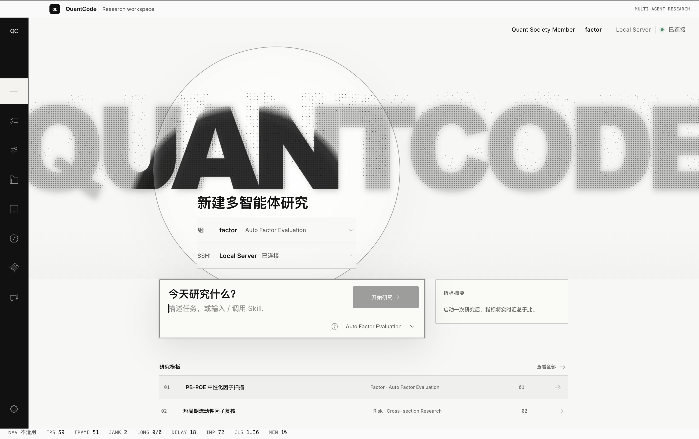
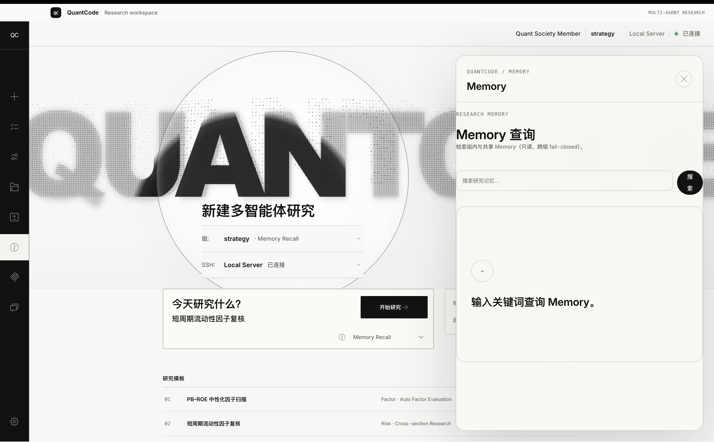

<div align="center">
  
# QuantCode

**Agent-driven quantitative research platform where six specialized teams compose through schema contracts**

[](LICENSE)
[](https://www.python.org/downloads/)
[](tests/)
[]()

[Quick Start](#quick-start) • [Screenshots](#screenshots) • [Architecture](#architecture) • [Six Workflows](#six-workflows) • [Documentation](#documentation) • [Contributing](#contributing)

</div>

---

## What is QuantCode?

QuantCode is an **agent orchestration platform** for quantitative investment research. Six domain teams (Factor, Model, Risk, Fundamental, Strategy, Options) use the same ReAct runtime with group-scoped skills, tools, and memory. Structured handoffs replace ad-hoc coordination. The platform enforces **schema contracts** at every boundary: factor submissions validate against `FactorSpec`, model metadata can feed the Risk CI chain, and cross-group state flows through a type-safe Blackboard.

**Core thesis**: Replace "people negotiating over Slack" with "machines validating against schemas." Replace "does this look okay?" with "`assert` pass/fail + deterministic gates."

Built on a fork of [OpenCode](https://github.com/anomalyco/opencode), cherry-picking modules from MimoCode (Memory, Checkpoint, Subagent orchestration), and adding six vertical Compose flows for quant workflows.

---

## Screenshots

<div align="center">
<br/>
<sub>Research workspace — roster-bound group context, SSH connection status, research templates</sub>
</div>

<div align="center">
<br/>
<br/>
<sub>Memory panel — query in-group and shared research memory (read-only, fail-closed across groups)</sub>
</div>

---

## News

| Date | Event |
|------|-------|
| 2026-08-30 | 📊 **Monitoring + Self-evolution closed loop** — `list_runs` MCP tool + desktop Monitor panel (`metrics.jsonl`), `/goal` → judge verdict (met/partial/missed) → RLHF回填 |
| 2026-08-29 | 🧭 Group identity via SSH key fingerprint and roster binding; local development may use an explicit fallback, while production requires roster authentication |
| 2026-08-28 | 🔁 Minimal replay CLI (list/show/resume), auto checkpoint (>70% snapshot / >90% rebuild), unified single checkpoint DB |
| 2026-07-16 | 🎯 **Beta Release** — 6-group E2E demos functional |
| 2026-07-15 | 🔐 Risk CI E2E: GitHub PR comments with auto-generated `RiskProfile` |
| 2026-07-10 | 🧪 Factor tools migrated from stub → real LLM (DeepSeek) for `gen_schema` + `match_main` |
| 2026-07-09 | 📐 HumanGate deterministic routing engine (Pattern 5: interrupt-resume) |
| 2026-07-05 | 🏗️ AgentRunner ReAct engine + self-built StateGraph (no `create_react_agent`) |

---

## Architecture

### Any domain → typed output

<div align="center">

</div>

```
User intent → Group-specific AgentRunner → Tool chain → Schema validation → Output artifact
     ↓
  Factor: match_main → gen_schema → quant_evaluator → FactorReport
  Model: read_pr → extract_metadata → generate_model_spec → (triggers Risk flow)
  Risk: read_blackboard → calc_risk → generate_risk_profile → CI/report result
     ↓
  All outputs: JSON artifacts under artifacts/{group}/ + optional PR comments
```

**Three production patterns:**

1. **Pattern 1 (Push)** — Factor group submits FactorSpec → evaluator returns evidence → acceptance produces a pass/fail result; shared-asset merge remains an explicit write operation
2. **Pattern 2 (Pull + Handoff)** — Model group publishes ModelSpec → Risk flow consumes the authorized Blackboard entry → CI/report output returns to the originating workflow
3. **Pattern 5 (Interrupt-Resume)** — ordinary Agent runs pause only for `merge` or `permission` decisions; Admin deployment uses a separate management surface

> Compose uses a shared ReAct runtime. The Agent chooses the next tool from the current state, while deterministic guards enforce iteration, loop, budget, and permission limits.

**Key primitives:**

- **AgentRunner** — Self-built StateGraph ReAct engine (not `create_react_agent`). Loads group-specific tools, injects skill markdown as system prompt, routes via `tool_routing_edge` → `route_next_step`.
- **ToolRegistry** — Global singleton. Each group's `_register.py` declares tools at import time. Tests use `importlib.reload()` to re-register after other tests clear the registry.
- **Blackboard** — SQLite-backed shared state with scoped ACL and transactional writes. Cross-group handoff carries only a minimal Artifact reference.
- **Memory** — FTS5 long-term Group Knowledge. Checkpoint/Progress/Trace remain Runtime State and do not appear as organizational Memory.
- **Schema contracts** — Every artifact validates against Pydantic models in `schemas/`. `FactorSpec`, `RiskProfile`, `StrategyReport`, etc.

---

## Six Workflows

Each group has a vertical Compose flow that produces a typed research or engineering artifact. Production deployment stays in the Admin management surface.

### 1. Factor (Owner: 肖骥超)

**Goal**: Discover and call the canonical QuantEvaluator without duplicating its metrics.

**Tools**: `match_main`, `gen_schema`, `quant_evaluator`. The evaluator returns a `ComponentCallResult`; an unavailable service returns `UNAVAILABLE`, never invented metrics.

**Flow**:
```python
idea = "高ROE低PB价值因子"
  ↓ match_main (LLM) → finds similar factors in main branch
  ↓ gen_schema (LLM) → generates a FactorSpec satisfying the schema contract
    (operators / estimated_runtime_seconds / forward_return_horizon included)
  ↓ quant_evaluator (API) → canonical evaluation result + source/version/environment
    API unavailable → result_status=UNAVAILABLE, no FactorReport fabricated
  ↓ optional shared write → validate_factor_contract → merge HumanGate
```

> `validate_factor_contract` validates the evidence. `merge_to_main` creates a shared-asset merge request and pauses on the `merge` HumanGate; an authorized approver or Admin makes the final decision.

**Demo**: `python scripts/demo_jerry_tracks.py --track factor` (factor track entry shared with the other 3 tracks; `runner/jerry_demos.py` remains the underlying module)

**Tests**: `tests/test_factor_tools.py`

**Status**: QuantEvaluator adapter is implemented; production connection remains environment-dependent and fails honestly when unavailable.

### 1b. SSH mainline reading (factor supporting feature)

`match_main` can read mainline code from your group's servers via SSH to ground matching in real signatures. Configure the `ssh_mainline` section in `config.example.json` (or `QUANTCODE_SSH_MAINLINE` env as JSON) and install the optional dependency:

```bash
pip install 'quantcode[ssh]'
```

Entry: `runner/server_ssh.py` — directory listing / file contents are cached under `~/.cache/quantcode/mainline/`, missing paramiko degrades gracefully (feature skipped with a warning).

---

### 2. Model (Owner: 陈镇鸿)

**Goal**: PR metadata extraction → structured handoff to the Risk CI/report chain.

**Tools**: `read_pr`, `extract_metadata`, `generate_model_spec`, `write_blackboard`

**Flow**:
```python
PR #42 opened → read_pr → extract model type/params from diff
  ↓ generate_model_spec → {"model_name": "pb_roe_ranker", "model_type": "ml", ...}
  ↓ write_blackboard(scope=PROJECT) → triggers Risk flow
  ↓ Risk flow reads ModelSpec → calculates risk_metrics → generates RiskProfile
  ↓ CI/report result returns to the workflow; no QuantCode output Gate
  ↓ write_pr_comment → posts RiskProfile JSON to PR
```

**Cross-group contract**: `ModelSpec` schema (must include `model_name`, `expected_sharpe`, `capacity_estimate`).

---

### 3. Risk (Owner: 杨欣琳)

**Goal**: Generate a structured `RiskProfile` for the CI/report chain and return threshold results.

**Tools**: `read_blackboard`, `calc_risk`, `generate_risk_profile`, `risk_verdict`, `write_pr_comment`, `request_human_review`

**Flow**:
```python
ModelSpec in Blackboard → calc_risk → {max_drawdown, tail_risk_var_99, position_limit}
  ↓ generate_risk_profile → enriched RiskProfile with thresholds
  ↓ risk_verdict → {verdict: "pass|fail", reasons: [...]}
  ↓ write_pr_comment → GitHub PR comment or CI artifact with full RiskProfile JSON
```

**Gate boundary**: Risk threshold results remain reports or CI statuses. QuantCode HumanGate handles shared writes and cross-group permissions; Admin handles production deployment separately.

**Demo**: `pytest tests/test_risk_react_ready.py -v`

**Production**: GitHub Actions may call the Risk flow for a PR and publish its report or status.

---

### 4. Fundamental (Owner: Lead)

**Goal**: Point-in-time safe research report generation (prevent lookahead bias in backtests).

**Tools**: `pit_rag_search`, `extract_financial`, `dcf_valuation`, `render_report`

**PIT safety**: Chroma vector DB with timestamp filter — 2023-01-01 backtest only retrieves docs from ≤ 2022-12-31.

---

### 5. Strategy (Owner: TBD)

**Goal**: Signal combination → group-owned backtest adapter → deployment request for Admin.

**Tools**: `select_signals`, `combine_signals`, `run_strategy_backtest`; deployment requests leave the ordinary Agent tool set.

**Deployment**: Admin submits the approved artifact through the Admin management surface and the production service account executes the controlled request.

---

### 6. Options (Owner: 刘炽)

**Goal**: Volatility surface construction + Greeks calculation for options strategies.

**Tools**: `build_vol_surface`, `calc_greeks`, `run_options_backtest`

**Output**: `artifacts/options/{symbol}_vol_surface.png` + GreeksProfile JSON

---

## Quick Start

### Install the desktop app

Team members should eventually install a packaged desktop release. Bun, Node.js, Git, and the OpenCode source tree will not be required for normal use. As of 2026-08-24, the complete unsigned four-target matrix and finalized release bundle passed in [OpenCode Actions run #32689170981](https://github.com/HKUST-QUANT-SOCIETY/opencode/actions/runs/32689170981): macOS Apple Silicon, macOS Intel, Windows x64, and Linux x64 (AppImage, DEB, RPM). No signed/notarized formal Release has been published.

Once the release status in [desktop installation and upgrades](docs/DESKTOP_INSTALLATION.md) is marked ready:

1. Open [QuantCode Releases](https://github.com/HKUST-QUANT-SOCIETY/quantcode/releases).
2. Download the signed/notarized macOS DMG/ZIP, signed Windows installer, or approved platform-unsigned Linux AppImage/DEB/RPM package for your platform.
3. Start QuantCode, choose your research group, and connect to Server B with your registered SSH identity.

See [desktop installation and upgrades](docs/DESKTOP_INSTALLATION.md) for the current readiness status, platform instructions, signing requirements, data locations, and automatic-update blocker.

### Install the research engine from source

The source workflow below is for QuantCode engine and desktop contributors. All product source now lives in this repository: Python at the root, UI in `frontend/packages/app`, and Electron in `frontend/packages/desktop`. See [repository layout](docs/REPOSITORY_LAYOUT.md).

#### Prerequisites

- Python 3.12+
- Bun (for OpenCode desktop)
- Git

#### One-command engine install

```bash
curl -fsSL https://raw.githubusercontent.com/HKUST-QUANT-SOCIETY/quantcode/main/scripts/setup.sh | bash
```

**Or manual development setup:**

```bash
# 1. Clone the single product repository
git clone https://github.com/HKUST-QUANT-SOCIETY/quantcode.git

# 2. Install QuantCode
cd quantcode
pip install -e .
# Optional: SSH mainline reading for factor group
pip install 'quantcode[ssh]'

# 3. Configure LLM via environment variables (no config file needed for the MCP chain)
export QUANTCODE_API_KEY="sk-your-deepseek-api-key"     # the only API key entry
export QUANTCODE_MODEL_PROVIDER="deepseek"              # deepseek | anthropic | stepfun (default deepseek)
export QUANTCODE_MODEL_NAME="deepseek-chat"             # optional, provider defaults apply
export QUANTCODE_MODEL_BASE_URL="https://api.deepseek.com/v1"  # optional, provider defaults apply
# Group identity:
#   Production: SSH public-key proof → server roster → actor/group/role/workspace
#   Local development only: export QUANTCODE_GROUP="factor"
# Optional: SSH mainline reading — copy config.example.json's ssh_mainline section
# into your own config.json (gitignored), or set QUANTCODE_SSH_MAINLINE env (JSON string)

# 4. Install the in-repository frontend/desktop workspace
bun run install:frontend

# 5. Start local web development (desktop: bun run dev:desktop)
bun run dev:quantcode
```

> **Config file note**: the MCP mainline (`quantcode.mcp_server` / `run_agent` tool) reads **only environment variables** — it never reads `config.json`. The `llm` section of `config.json` is consumed only by runner-direct scripts (`runner/llm_config.py`). `config.example.json` documents this split.

### Conversational path

Open QuantCode desktop → authenticate with a local SSH identity → let the server roster bind your group → type:

```
我想开发一个基于ROE和PB的价值因子
```

Agent auto-runs: `match_main` → `gen_schema` → `quant_evaluator`. It shows metrics only when returned by the canonical component.

### Provider binding (desktop)

Desktop settings → **Providers**: third-party providers only — enter display name / Base URL / API Key in one form, then click **获取模型列表 (Fetch models)** to list available models live from the provider's `/models` endpoint. No official-provider OAuth flows.

### Library path

```python
from tools.registry import registry

# Factor group
result = registry.call("gen_schema", {
    "idea": "momentum factor using 20-day return",
    "match_result": {"main_branch": "momentum", "similar_factors": []}
})
# Returns: {"name": "momentum_20d", "formula": "close/close.shift(20)-1", ...}

# Risk group
risk = registry.call("calc_risk", {
    "model_spec": {"model_name": "test", "expected_sharpe": 1.5},
    "scenario": "high_risk"
})
# Returns: {"max_drawdown": 0.22, "tail_risk_var_99": 0.085, ...}
```

### Run E2E demos

```bash
# All tracks
python scripts/demo_jerry_tracks.py --track all

# Individual tracks
python scripts/demo_jerry_tracks.py --track strategy
python scripts/demo_jerry_tracks.py --track fundamental
python scripts/demo_jerry_tracks.py --track options
python scripts/demo_jerry_tracks.py --track factor  # factor track entry
```

(Day-5 test: `python -m pytest tests/test_day5_jerry_demos.py::test_day5_all_demos -v`)

---

## Testing

```bash
# Full suite
pytest

# Specific group
pytest tests/test_risk_react_ready.py -v

# Factor tools
pytest tests/test_factor_tools.py -v

# Model→Risk handoff E2E
pytest tests/test_model_risk_handoff_e2e.py -v

# With real LLM (requires QUANTCODE_API_KEY)
QUANTCODE_FACTOR_USE_REAL_LLM=1 pytest tests/test_factor_tools.py -v
```

**Test status**: 1060 passed, 4 skipped (2026-09-05). The skipped tests require explicit real-LLM access.

**Coverage**: AgentRunner (ReAct engine), tool registry, Blackboard (scoped isolation), Memory (FTS5), routing guards, HumanGate (interrupt-resume), cross-group handoff (Model→Risk), factor tools (real LLM plus deterministic local fixtures), risk metrics (real returns + explicit stub marking), metrics/monitor read path.

## Sessions & Monitoring

- **Replay**: `python scripts/replay.py list|show|resume` — list threads, inspect a checkpoint, and resume a paused shared-write or permission Gate with `--decision approve|reject`.
- **Run metrics**: `.quantcode/metrics.jsonl` written by agent engine completion hooks; query via the read-only `list_runs` MCP tool or the desktop Monitor panel.
- **Goal judging**: `/goal <objective>` in desktop before running → after `run_agent` finishes, a judge verdict (`met` / `partial` / `missed` / `unevaluated`) is produced and fed back into RLHF (`apply_judged_session`). Goal/Judge supplies evidence; it does not make a domain or deployment decision.
- **Auto checkpoint**: context >70% snapshots → >90% rebuilds (`runner/agent_nodes.py`, ~4 chars/token approximation, tunable via `QUANTCODE_CONTEXT_TOKENS`). Single checkpoint DB: `.quantcode/checkpoints.db`.

**Coverage**: AgentRunner (ReAct engine), tool registry, Blackboard (scoped isolation), Memory (FTS5), routing guards, HumanGate (interrupt-resume), cross-group handoff (Model→Risk).

---

## Documentation

- **[User Manual](docs/USER_MANUAL.md)** — End-to-end guides for all 6 groups
- **[Technical Design](docs/QuantCode_Design.md)** — current v5 architecture and module boundaries
- **[Historical specifications](docs/archive/pre-v5/README.md)** — pre-v5 material, not current behavior
- **[Testing Guide](TEST_GUIDE.md)** — current v5 test commands and contract boundaries
- **[PRD](docs/PRD.md)** — Product requirements, acceptance criteria

---

## In Production

**Target deployment**: HKUST QUANT SOCIETY internal platform (12-18 users across 6 groups).

**Current stage**: Development acceptance in progress. See the [current functional audit](docs/audit/FULL_PRODUCT_AUDIT_2026-09-05.md) for verified results and open integration requirements. Source consolidation does not establish production connectivity or installer readiness.

---

## Roadmap

- [x] **QuantEvaluator adapter** — calls the canonical API and returns an explicit `UNAVAILABLE` envelope when disconnected; no mock fallback.
- [x] **Replay / auto checkpoint** — `scripts/replay.py` (list/show/resume shared-write or permission runs) + context >70% snapshot / >90% rebuild. *(done 2026-08)*
- [x] **Monitoring dashboard v0** — `list_runs` read-only MCP tool + desktop Monitor panel aggregating `.quantcode/metrics.jsonl`. *(done 2026-08)*
- [x] **Shared-write merge path** — factor asset merge requests use the `merge` HumanGate contract; domain owners retain the final decision
- [x] **Parallel agent workflows** — bounded Subagent registry with inherited group permissions and budgets
- [x] **Token budget management** — runtime budget limits, explicit exhaustion state, and checkpoint support
- [ ] **Dynamic Tool Catalog enforcement** — replace compatibility allowlists with roster-derived effective tool sets on every production call
- [ ] **Production deployment adapter** — connect the Admin management surface to the real production service account and adapter
- [ ] **Desktop app packaging** — bundled Python sidecar / installable build

---

## Contributing

**Agent-first workflow** (recommended):

Open the QuantCode desktop → authenticate with your local SSH identity → type:

```
/implement add a new tool for calculating Fama-French 3-factor exposures
```

The Model agent will:
1. Generate `tools/factor/fama_french.py` with ToolDef
2. Register in `tools/factor/_register.py`
3. Write unit tests in `tests/test_fama_french.py`
4. Run tests and fix until green
5. Create PR with summary

**Manual workflow**:

```bash
# 1. Create feature branch
git checkout -b feat/your-feature

# 2. Make changes
# 3. Add tests (test coverage must not decrease)
pytest tests/test_your_feature.py

# 4. Commit with conventional commits format
git commit -m "feat(factor): add Fama-French 3-factor tool"

# 5. Push and open PR
git push origin feat/your-feature
gh pr create
```

> **IMPORTANT**: GitHub Actions may run the Risk CI chain on PRs. QuantCode HumanGate applies to shared writes and cross-group permissions; production deployment remains an Admin-only management action.

**Code style**: Black (line length 100), Ruff (target py312), type hints required.

---

## License

MIT License — see [LICENSE](LICENSE) for details.

---

## Acknowledgements

Built by the HKUST QUANT SOCIETY Agent Group (6 people):
- **Lead**: Hendrix Chen (chenyuanheng0127@gmail.com)
- **Factor**: 肖骥超
- **Model**: 陈镇鸿
- **Risk**: 杨欣琳
- **Fundamental**: Lead
- **Options**: 刘炽

**Technology stack**:
- [OpenCode](https://github.com/anomalyco/opencode) — Desktop shell fork
- [LangGraph](https://github.com/langchain-ai/langgraph) — StateGraph orchestration
- [LangChain](https://github.com/langchain-ai/langchain) — Tool abstractions
- [DeepSeek](https://www.deepseek.com/) — LLM for schema generation and matching
- Cherry-picked from [MimoCode](https://github.com/MimoCode/mimocode): Memory, Checkpoint, Subagent modules

---

<div align="center">
  
**[⬆ Back to Top](#quantcode)**

Made with ☕ by the HKUST QUANT SOCIETY Agent Group

</div>
