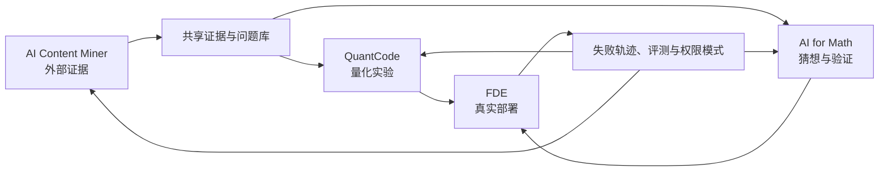

# AI Agent 组的下一步

## 量化研究、AI for Math 与 FDE 的未来两到三年

> 资料时点：2026 年 8 月 16 日  
> 讨论对象：AI Agent 组的研究方向与项目演进  
> 主要读者：组内成员、教授与潜在合作方

## 这份报告讨论什么

这份报告讨论一个具体问题：AI Agent 组接下来应该研究什么，并以什么方式形成自己的长期判断。

重点放在行业变化、技术路线和项目之间的关系。人员编制、预算分配与治理流程不构成本文主线。现有的 AI Content Miner 和 QuantCode 是两项在建项目；AI for Math 与 Forward Deployed Engineering，简称 FDE，是准备扩展的两项新项目。四者需要分别成立，也要共享证据、评测和真实使用反馈。

本文的判断很具体：AI Agent 将先改变量化研究的生产方式。模型已经降低了写代码和查资料的成本。接下来的变化会触及假设提出、实验设计、结果复核、知识沉淀与跨角色协作。研究流程开始变成一种可执行、可回放、可评测的系统。

这也解释了为什么 AI for Math 与 FDE 值得单独立项。前者研究机器如何在严格验证下推理和发现，后者研究 Agent 如何进入真实机构的高上下文工作。一个提供硬验证，另一个提供现实反馈。两者都能纠正只看模型演示的技术视角。

写法上，本文借鉴了 [Situational Awareness](https://situational-awareness.ai/) 的一个方法：先辨认能力变化，再寻找阻碍能力进入现实的约束，最后讨论这些约束会怎样改变组织。本文不采纳其中关于 AGI 时间表的预测，也不把模型基准直接当成行业结果。

## Agent 正在改写量化研究的生产函数

量化研究长期受几类约束：数据口径不稳定，实验重现成本高，研究经验难以沉淀，研究员与工程系统之间存在大量手工交接。大模型首先缓解了信息处理和代码生成。Agent 再向前一步，把多次模型调用、工具操作、状态记录和人工审批组织成连续任务。

这种变化会依次穿过四层。

第一层是个人效率。研究员用模型解释论文、补代码、生成 SQL、检查报错。这一层已经普及，优势也最容易被竞争者追平。

第二层是任务自动化。Agent 能完成一条边界清晰的链路，例如抓取资料、清洗数据、生成因子表达式、调用回测、汇总结果。多数机构正在这一层试验。

第三层是研究闭环。系统保存每个假设的证据来源、数据版本、实现代码、实验结果和否决理由。失败研究开始产生可复用价值，Agent 也能从经过验证的历史轨迹中继续工作。

第四层是组织能力。研究环境能把真实失败自动变成评测，将高频人工修正转成工具和约束，并允许不同专业角色围绕同一组可审计对象协作。此时，模型只是系统的一部分。

[《中国量化投资白皮书》](</Users/hendrixchen/ObsidianVault/量化投资知识库/中国量化投资白皮书_完整版.md>)的第 19 题提供了一个有用的行业截面。178 份有效答卷中，62.92% 的机构使用 Agent 生成基础代码，56.74% 用于研报或会议纪要的语义理解与入库，52.25% 用于因子表达式挖掘与验证，43.82% 用于智能回测和策略归因。实时指令监控与合规拦截只有 21.91%，自博弈生成合成数据为 15.73%。另有 12.36% 表示尚无实质应用。

这组数据来自机构自报，多选题也不能证明生产效果。它仍然揭示了当前结构：应用集中在代码、文本和研究辅助，越接近实时决策与高风险执行，采用率越低。行业已经越过“是否使用大模型”的争论，尚未解决“如何信任由 Agent 组织的研究过程”。

## 代码变便宜后，什么仍然稀缺

当代码和候选想法越来越便宜，竞争优势会转移到以下位置。

- 可验证的研究规格。一个因子需要明确数据时点、样本范围、交易成本、延迟假设、缺失值处理和否决阈值。
- 高质量评测。Agent 需要面对真实的坏数据、隐蔽泄漏、模糊论文和失败实验，不能只在干净任务上得分。
- 经过审计的组织记忆。系统要保留结论成立的条件，也要保留结论被推翻的过程。
- 工作流接入。权限、数据边界、现有研究平台和审批责任决定 Agent 能否进入生产环境。
- 研究品味。机器可以扩大候选空间，问题选择、证据强度和风险承担仍由人负责。

因此，未来量化团队的差异不会主要表现为“谁接入了更强的模型”。更持久的差异来自专有上下文、验证器、实验基础设施和现场反馈的组合。

微软的 [RD-Agent(Q)](https://arxiv.org/abs/2505.15155) 已经展示了“研究、开发、反馈”循环在量化任务中的一种实现。论文报告了因子与模型协同优化以及基于 bandit 的调度，并给出明显的实验收益。报告中的收益来自作者设定的研究环境，不能直接外推为实盘 Alpha。它更有价值的地方是系统结构：Agent 生成候选，工具执行实验，反馈改变下一轮搜索。

## Agent 在量化中的能力边界

Agent 适合处理开放搜索、跨工具编排和非结构化信息。精确数值计算、组合优化、风险约束与高速执行仍应交给确定性程序、统计模型和专用求解器。一个可靠的量化系统可以让 Agent 扩大搜索，让数学与程序收敛结果，再由人承担风险决策。

这条边界有三层理由。

语言模型善于生成看似完整的解释，数值正确性却没有天然保证。回测泄漏、复权错误、幸存者偏差和交易成本假设都可能藏在流畅叙述里。

Agent 的工具调用会把语言错误放大为系统动作。读取错误数据只影响一次回答，写入数据库、提交订单或修改风险参数会产生更大后果。

同一批基础模型和相似提示可能产生相关判断。[金融稳定委员会](https://www.fsb.org/2024/11/fsb-assesses-the-financial-stability-implications-of-artificial-intelligence/)将第三方集中、市场相关性、网络风险、模型与数据治理列为 AI 在金融体系中的主要脆弱点。[BIS Project Logos](https://www.bis.org/about/bisih/topics/suptech_regtech/logos.htm)也在模拟环境中研究 LLM 投资组合经理的同质化与相关决策。多 Agent 的数量不能自动带来观点多样性。

外部能力评测也提醒我们区分基准与真实工作。[METR 的时间跨度研究](https://evals.alignment.org/time-horizons/)使用可评分的软件、机器学习和网络安全任务衡量模型能力。这些任务比机构内的高上下文研究更干净。METR 在 [2025 年对资深开源开发者的随机试验](https://metr.org/blog/2025-07-10-early-2025-ai-experienced-os-dev-study/)中观察到，受试者使用当时的 AI 工具后平均多花了 19% 的时间，尽管他们主观认为自己提速了约 20%。[2026 年更新](https://metr.org/blog/2026-02-24-uplift-update/)认为新工具可能已经改善表现，也指出选择偏差和并行 Agent 让精确估计变得困难。能力曲线在上升，落地效果仍需在自己的任务上测量。

## 现有项目已经提供了两个起点

### AI Content Miner：外部感知与证据入口

[AI Content Miner 的设计文档](</Users/hendrixchen/Library/Containers/com.tencent.WeWorkMac/Data/Library/Application Support/WeMail/cache/attach/1494216074/df7a2a64d551aee7/13ac4fbf239fb141/bot-design-and-roadmap.md>)把目标定义得很清楚：系统把高噪声信息流转换为可核验、可阅读、可分发的研究候选。它已经区分 README 声明、代码证据、模型判断和未核验范围，并通过显式状态、降级策略、成本预算和幂等交付处理外部系统的不确定性。

这项工作的价值超出每日内容推送。它可以成为组内持续运行的前沿证据引擎，回答外部发生了什么、哪些进展值得复现、哪些说法只有营销材料，以及哪些代码可以进入实验环境。

下一阶段应把研究对象做扎实。增加抓取渠道的优先级较低。每条候选需要进入统一证据对象，至少保留原始来源、抓取时间、代码或论文版本、主张、证据强度、待验证问题和后续实验。日报只是这个系统的一种视图。

### QuantCode：研究执行环境

[QuantCode README](</Users/hendrixchen/Desktop/私募/QUANTcode/README.md>)和[设计文档](</Users/hendrixchen/Desktop/私募/QUANTcode/docs/QuantCode_Design.md>)显示，项目已经具备相当完整的工程骨架：六个量化研究组、AgentRunner、ReAct 状态图、ToolRegistry、Blackboard、分层 Memory、Schema 契约、HumanGate 和可回放的检查点。2026 年 7 月 16 日的 Beta 记录为 597 项测试中 589 项通过。

这说明项目的难点已经发生变化。继续增加通用框架能力会提高完成度，却未必提高使用价值。QuantCode 现在需要一条能被研究员反复使用的研究闭环：

```text
证据 -> 可检验假设 -> 研究规格 -> 代码与数据 -> 实验 -> 反证检查 -> 人工判断 -> 可复用记忆
```

这条闭环应由一个窄而困难的任务驱动，例如因子论文复现、财务事件信号验证或模型提交后的风险审查。每轮运行都要留下结构化产物。研究员应该能看见 Agent 为什么选择某项数据、哪条验证失败、人工在哪一步改变了判断。QuantCode 当前应该提高的，是这类真实研究循环的运行密度。

## AI for Math：建立硬验证下的推理与发现能力

AI for Math 是一条独立研究方向。它研究机器如何提出数学候选、寻找反例、调用符号或数值工具、构造证明，并把结果交给形式系统或专家核验。这个方向与通用聊天模型的区别在于，许多数学任务拥有可执行的验证条件。

### 2024 至 2026 年的能力变化

2024 年，Google DeepMind 的 AlphaProof 与 AlphaGeometry 2 在国际数学奥林匹克题目上获得 28 分，达到银牌水平。系统需要把题目人工翻译为形式语言，部分求解耗时达到数日。[这项结果](https://deepmind.google/blog/ai-solves-imo-problems-at-silver-medal-level/)展示了神经模型与符号验证结合的力量，也暴露了形式化瓶颈。

2025 年，DeepMind 的 Gemini Deep Think 在官方评分下获得 35 分，解出六题中的五题，达到金牌标准，并在 4.5 小时比赛时限内用自然语言完成。[这次进展](https://deepmind.google/blog/advanced-version-of-gemini-with-deep-think-officially-achieves-gold-medal-standard-at-the-international-mathematical-olympiad/)说明长程推理和自然语言证明已经明显进步。奥赛题仍然边界清晰，不能代表开放研究数学。

[AlphaEvolve](https://deepmind.google/blog/alphaevolve-a-gemini-powered-coding-agent-for-designing-advanced-algorithms/)提供了另一条路线。系统让语言模型生成算法候选，再由自动评估器筛选和演化。DeepMind 报告它在 50 多个开放问题上重新发现约 75% 的已知最佳结果，并在约 20% 的问题上改进已有结果；它也找到 4x4 复矩阵乘法的 48 次标量乘法方案。系统能够工作的关键条件很具体：候选可以写成程序，结果可以自动评分。

2026 年公布的 [Aletheia](https://deepmind.google/blog/accelerating-mathematical-and-scientific-discovery-with-gemini-deep-think/)更接近研究 Agent。它包含候选生成、自然语言验证、修订与重启，并允许系统承认失败。DeepMind 展示了若干由专业数学家参与的研究案例。部分基准为内部构建，案例也主要来自作者报告，现阶段适合用来判断技术形态，尚不足以证明普遍研究生产率。

这些系统采用了相近的分工：模型扩大搜索，验证器淘汰错误，专家定义问题并判断新颖性。数学推理由一次回答变成持续的猜想与验证循环。

### AI for Math 的技术栈

[一份 2026 年的综合综述](https://arxiv.org/abs/2606.08728)将该领域组织为非形式推理、形式推理、数学发现，以及连接生成与验证的推理和训练技术。结合本组的任务，可以把技术栈拆为四类能力。

- 非形式推理：阅读论文、解释定义、拆解问题、生成证明草图。
- 形式化与定理证明：把自然语言陈述翻译为 Lean 等形式语言，并由内核检查证明。
- 可验证搜索：生成算法、构造反例、运行符号计算或数值实验，用自动评分器引导搜索。
- 人机协作：专家修改定义、选择子问题、识别已有工作，并决定结果是否具有数学价值。

[Lean 与 mathlib](https://leanprover-community.github.io/papers/mathlib-paper.pdf)说明形式证明依赖长期积累的定义、定理库和社区维护。证明内核能验证一段形式证明，却不会自动保证问题表述与研究者原意一致。自然语言到形式语言的翻译仍是主要风险点。

### 本组的切入点

本组没有必要与前沿实验室竞争通用定理证明基础模型。更合适的切口是金融数学与量化研究中的可验证任务。这个领域同时具备数学深度、现有专业关系和明确的下游应用。

可优先建立五类问题集：随机过程与随机微积分推导，组合优化的约束与性质，偏微分方程数值格式的稳定性和收敛性，概率不等式与统计估计，风险模型和投资组合约束的形式正确性。

第一个原型可以是一套 AI for Math Workbench。研究者提交问题和背景资料后，系统检索定义与相关结果，生成候选思路，调用 Python、Julia、Mathematica 或 SymPy 做数值与符号检查，主动寻找反例，再把适合形式化的部分送入 Lean。最终产物同时保留自然语言说明、机器验证结果、失败轨迹和专家意见。

教授合作为这一项目提供首个真实研究环境。教授能够定义有价值的问题、识别貌似正确的证明、提供历史解法与评价标准。课程可以贡献学生反馈、问题语料和人才培养，但项目主体应保持为持续的研究系统。这样，AI for Math 才能在学期结束后继续积累基准、工具和数学知识库。

### 它为什么属于 AI Agent 组

AI for Math 提供了少见的硬反馈环境。多数知识工作只能由人主观评价，数学任务可以利用类型检查、证明内核、反例和数值误差给出明确反馈。组内可以借此研究规划、长程记忆、工具选择、失败恢复和验证器设计。这些能力随后能回到 QuantCode。

项目也会迫使团队正视几个基本问题：Agent 会不会利用评估器漏洞；自然语言陈述是否被错误形式化；证明正确是否等于结论有价值；检索到的相似证明是否造成新颖性误判。综述还将脆弱性、奖励黑客、多模态落地和推理能耗列为开放问题。解决这些问题，比在普通问答基准上继续抬分更接近可靠 Agent 研究。

### 从题库走向开放研究

近期应完成一个小型但高质量的金融数学题库。每道题保存自然语言陈述、依赖定义、已知解法、可运行检查、难点标签和专家评分。选择一批能在 Lean 或数值环境中核验的题目，先测量现有模型的真实能力。

随后建设完整的猜想与验证循环，并让教授和研究者在实际任务中使用。系统需要记录人工修正发生在哪里，也要记录无法形式化或无法判断新颖性的案例。

当题库和工作流稳定后，项目才适合扩展到开放研究问题、跨学科数学和更强的自主搜索。届时可形成论文、开源基准、课程材料与研究工具。顺序很重要：先建立验证资产，再追求更大的自主性。

## FDE：把真实部署变成研究反馈

FDE 在这里指 Forward Deployed Engineering。它是一项独立项目，研究 Agent 如何进入高上下文、强约束的真实工作流，并把现场经验送回核心产品和研究。

[OpenAI 对 FDE 职位的定义](https://openai.com/careers/forward-deployed-engineer-%28fde%29-seattle-seattle/)覆盖需求发现、范围界定、系统设计、构建与上线。成功标准包括生产采用、可测量的工作流影响，以及能改变产品或模型路线的评测反馈。其 [FDE Platform Engineer](https://openai.com/careers/platform-engineer-forward-deployed-engineering-%28fde%29-nyc-new-york-city/)进一步强调权限、审计、数据边界、上线安全、可观测性和错误分析。FDE 已经成为 AI 公司连接模型能力与复杂组织的重要组织形式。

Palantir 长期采用前置部署工程。其[架构说明](https://www.palantir.com/docs/foundry/architecture-center/overview)把 FDE 描述成一种接近问题现场的反馈机制，现场洞察持续进入核心工程。2026 年，Palantir 又发布了可用自然语言操作 Foundry 的 [AI FDE](https://www.palantir.com/docs/foundry/ai-fde/overview)。这显示 FDE 自身也开始被 Agent 化。

### FDE 项目的研究问题

模型演示通常缺少真实权限、脏数据、组织责任和长期维护。FDE 研究这些约束如何改变 Agent 设计。它关心以下问题：

- 用户的实际工作流与口头需求有何差异。
- 哪些上下文必须进入系统，哪些数据必须隔离。
- 模型失败如何被观测、复现并转成评测。
- 一次部署中的定制能力如何沉淀为可复用工具。
- 人工审批应该出现在哪些动作之前。
- 系统上线后是否被持续使用，是否改善了目标工作。

一个完整的 FDE 循环可以写成：

```text
进入现场 -> 绘制工作流 -> 定义成功与风险 -> 共建原型 -> 真实任务评测
-> 小范围上线 -> 收集失败 -> 抽象为工具、评测和产品需求 -> 回到核心项目
```

FDE 的产物应包括部署系统，也包括一份可迁移的 Field Package：工作流地图、权限与数据边界、真实评测集、失败分类、复用组件、上线后的使用证据。缺少这些资产的项目容易停留在一次性交付。

### 本组可以从哪里开始

量化研究是一个合适的 FDE 场景。团队与一组真实研究员共同选择高频任务，把 AI Content Miner 或 QuantCode 接入现有数据和研究流程。目标可以是论文复现、因子初筛、风险审查或研究归档。每次人工纠错都回写为评测样本。

数学研究提供了另一类场景。团队进入教授和学生的研究流程，观察他们如何选题、查证、试算、写证明与复核。AI for Math 的题库、工具接口和人审位置由这些观察塑造。

还可以选择一个外部合作方，验证跨组织的数据边界、权限和部署方式。初期范围应保持窄，优先处理通用聊天产品表现不佳的高上下文任务。

### 定制服务陷阱

FDE 很容易滑向定制开发。a16z 在 [The Palantirization of Everything](https://a16z.com/the-palantirization-of-everything/) 中指出，前置部署只有在背后存在强产品平台时才形成规模效应。复制嵌入式工程师的形式，却没有把现场需求沉淀回产品，会产生大量难以维护和升级的部署。

本组需要警惕几种迹象：每个合作方拥有独立代码分支；项目靠少数成员长期救火；客户短期需求持续改写核心路线；系统上线后没有使用数据；失败停留在聊天记录中；一次交付没有产生新的评测或复用组件。

[a16z 对服务驱动增长的分析](https://a16z.com/services-led-growth/)也提出，复杂 Agent 的上线很像新员工入职，需要持续的上下文配置和管理。服务工作本身可以创造价值，关键在于是否形成产品学习。对本组而言，FDE 项目的上限取决于现场经验回流的速度和质量。

### 从首个部署点到方法沉淀

近期选择一到两个有明确负责人和真实任务的部署点。先记录当前流程的时间、错误和人工判断，再上线小范围 Agent。项目验收同时检查工作流改善与可复用资产。

下一阶段建立标准化的 Field Package 和反馈管道。QuantCode 的权限、工具、评测、HumanGate 与可观测性应随着部署经验收敛。AI Content Miner 和 AI for Math 也通过同一机制接收现场失败。

两到三年后，FDE 项目应该拥有一套可讲清楚的方法：团队能快速理解一个高上下文工作流，构建受控 Agent，测量其效果，并把现场知识送回平台。它可以成为合作入口，也可以成为组内研究问题最稳定的来源。

## 四个项目如何组成一条研究路线

四项工作各自回答不同问题。AI Content Miner 负责发现外部证据，QuantCode 负责执行量化研究，AI for Math 负责在硬验证下探索推理与发现，FDE 负责把系统放进真实环境。它们共享的底层资产是证据对象、评测集、工具协议、权限边界和经过验证的任务轨迹。

| 项目 | 当前定位 | 核心产物 | 对其他项目的贡献 |
| --- | --- | --- | --- |
| AI Content Miner | 在建项目 | 可追溯的前沿证据与研究候选 | 给 QuantCode 和 AI for Math 提供待复现问题 |
| QuantCode | 在建项目 | 可执行、可回放的量化研究环境 | 承载实验、风险检查与组织记忆 |
| AI for Math | 扩展项目 | 数学题库、验证器、猜想与证明工作台 | 提供严格评测和可验证搜索方法 |
| FDE | 扩展项目 | 真实部署、Field Package、现场评测 | 提供需求、失败数据和产品反馈 |

它们之间的关系可以画成一条循环：



这张图不要求把四项工作合并成一个大平台。共享对象和反馈协议已经足够。各项目保留自己的用户、节奏和技术判断，可以避免大一统架构拖慢探索。

## 未来两到三年的主线

### 近期：建立一条可信的闭环

最优先的工作是让一个真实问题穿过证据、假设、实验、验证和记忆。QuantCode 以窄任务完成闭环；AI Content Miner 输出结构化研究候选；AI for Math 建立第一批可验证题目；FDE 选择首个现场合作点。

这一阶段应减少平台层扩张。任何新功能都要回答它改善了闭环中的哪一步，是否能产生可观察的结果。

### 中期：让项目之间交换经过验证的资产

当单点闭环稳定后，四项工作开始共享问题格式、证据引用、实验产物和评测。Content Miner 发现的一篇论文可以直接生成 QuantCode 复现任务；QuantCode 中出现的数学疑点可以进入 AI for Math；FDE 现场暴露的失败可以进入两个项目的回归集。

此时，组内知识库开始保存过程知识，包括某项主张如何被验证、某个方案为何失败，以及什么条件下可以重现。文档检索仍是入口，经过验证的研究轨迹会成为更有价值的部分。

### 后期：形成有辨识度的研究计划

两到三年后，AI Agent 组应能用一组公开或内部成果说明自己的方向：一个持续运行的前沿证据系统，一个被真实研究任务使用的 QuantCode 环境，一套金融数学 Agent 的基准与工作台，以及若干能产生复用资产的 FDE 项目。

这些成果共同表达一种研究立场：Agent 的价值要通过可验证任务和真实工作流来判断。团队可以据此发表论文、建设开源基准、与教授共建研究，也能与机构开展边界清楚的合作。

## 需要主动证伪的判断

一份长期规划需要说明何时应该改变方向。以下信号值得严肃对待。

- QuantCode 连续多个迭代仍没有研究员重复使用同一闭环，说明用户任务选择更可能是症结，继续增加框架功能的作用有限。
- AI for Math 的金融数学题目无法形成可靠验证，或专家投入长期高于系统节省的时间，需要缩小任务范围。
- FDE 项目持续产生定制代码，复用资产和评测增长很慢，应暂停扩张并修复产品反馈管道。
- Content Miner 的候选很少进入复现或讨论，说明信息筛选与研究需求脱节。
- Agent 在真实任务上没有提高质量、速度或可审计性，即使基准分数继续上升，也不应扩大自主权限。

这些条件能保护团队免受技术叙事牵引。项目可以保留雄心，结论必须接受数据和使用行为的约束。

## 我们应当坚持的研究立场

未来几年，量化行业会拥有大量会写代码、会调用工具、会生成研究报告的 Agent。单次生成能力会快速商品化。行业认知的改变发生在另一个层面：研究过程可以被机器执行、被验证器检查、被组织持续积累。

AI Agent 组已经拥有两个合适的起点。AI Content Miner 接触外部知识，QuantCode 接触研究执行。AI for Math 将验证推进到数学层面，FDE 则把系统带入真实使用。四个项目的共同任务，是建立从证据到判断的可靠路径，并持续从失败中获得可复用信息。

这条路线的目标很克制。团队要把开放式智能放进有证据、有边界、有反馈的环境，并持续观察真实使用、验证资产和研究记忆是否增长。这些结果将决定方向能否成立。

## 主要资料

### 本地资料

- [中国量化投资白皮书](</Users/hendrixchen/ObsidianVault/量化投资知识库/中国量化投资白皮书_完整版.md>)
- [AI Content Miner 设计与演进规划](</Users/hendrixchen/Library/Containers/com.tencent.WeWorkMac/Data/Library/Application Support/WeMail/cache/attach/1494216074/df7a2a64d551aee7/13ac4fbf239fb141/bot-design-and-roadmap.md>)
- [QuantCode README](</Users/hendrixchen/Desktop/私募/QUANTcode/README.md>)
- [QuantCode 设计文档](</Users/hendrixchen/Desktop/私募/QUANTcode/docs/QuantCode_Design.md>)

### 外部资料

- Leopold Aschenbrenner, [Situational Awareness: The Decade Ahead](https://situational-awareness.ai/)
- Google DeepMind, [AI solves IMO problems at silver medal level](https://deepmind.google/blog/ai-solves-imo-problems-at-silver-medal-level/)
- Google DeepMind, [Gemini Deep Think achieves IMO gold medal standard](https://deepmind.google/blog/advanced-version-of-gemini-with-deep-think-officially-achieves-gold-medal-standard-at-the-international-mathematical-olympiad/)
- Google DeepMind, [AlphaEvolve](https://deepmind.google/blog/alphaevolve-a-gemini-powered-coding-agent-for-designing-advanced-algorithms/)
- Google DeepMind, [Aletheia and mathematical discovery](https://deepmind.google/blog/accelerating-mathematical-and-scientific-discovery-with-gemini-deep-think/)
- The mathlib Community, [The Lean Mathematical Library](https://leanprover-community.github.io/papers/mathlib-paper.pdf)
- OpenAI, [Forward Deployed Engineer](https://openai.com/careers/forward-deployed-engineer-%28fde%29-seattle-seattle/)
- OpenAI, [Platform Engineer, Forward Deployed Engineering](https://openai.com/careers/platform-engineer-forward-deployed-engineering-%28fde%29-nyc-new-york-city/)
- Palantir, [Architecture Center](https://www.palantir.com/docs/foundry/architecture-center/overview)
- Palantir, [AI FDE](https://www.palantir.com/docs/foundry/ai-fde/overview)
- a16z, [The Palantirization of Everything](https://a16z.com/the-palantirization-of-everything/)
- a16z, [Trading Margin for Moat](https://a16z.com/services-led-growth/)
- Microsoft Research, [RD-Agent(Q)](https://arxiv.org/abs/2505.15155)
- METR, [Measuring AI Ability to Complete Long Tasks](https://evals.alignment.org/time-horizons/)
- METR, [Early-2025 AI Experienced Open-Source Developer Study](https://metr.org/blog/2025-07-10-early-2025-ai-experienced-os-dev-study/)
- Financial Stability Board, [The Financial Stability Implications of Artificial Intelligence](https://www.fsb.org/2024/11/fsb-assesses-the-financial-stability-implications-of-artificial-intelligence/)
- Bank for International Settlements, [Project Logos](https://www.bis.org/about/bisih/topics/suptech_regtech/logos.htm)
