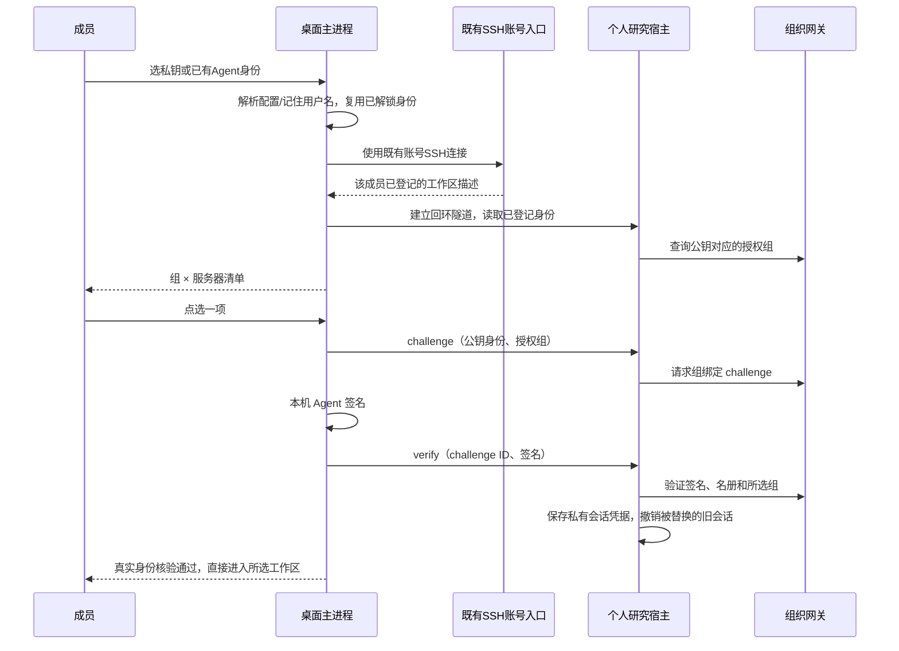

# QuantCode 两步登录

2026-09-15。本文描述 Test V1.2 登录修复后的实现；成员只需持有已登记公钥对应的本地私钥。A/B/C 地址内置，不要求填写 URL、端口或访问密码。

管理员按 [统一管理员登录](ADMIN_LOGIN.md) 一次认证后使用完整工作台；以下步骤适用于组员。

## 成员操作

有效会话：打开应用自动恢复所选研究宿主的 SSH 隧道，核验已有会话，进入工作台。恢复不会再次签名，也不会延长过期会话。

重新登录：

1. 点击「重新登录」选择私钥，或使用系统 SSH Agent 中已有的身份。应用读取已有 SSH 配置，文件名只作为用户名提示；通用名称如 `id_ed25519` 无法确定账号时，填写原来能登录服务器的用户名，并按公钥指纹记住。已解锁的加密私钥直接复用 Agent；未解锁时可打开本机终端处理。私钥正文不上传。
2. 应用 SSH 探测 A/B/C，使用服务端连接描述将既有账号对应到实际研究账号；已有本人 profile 的入口继续兼容。描述中的目标仍须通过公钥和组织授权核验。界面列出「组 × 实际工作区服务器」，点选后完成签名认证并直接进入，成员无需填写内部账号或端口。

未登记或尚未开通个人宿主的服务器显示不可用原因，其余服务器继续可选。取消文件选择没有副作用，也不显示用户名错误。

## 组和身份来源

经用户确认：Linux 组用于发现和排序，组织名册补足并限制清单。已有研究账号可以保持仅有 `qc-<actor>` 私有 Linux 组；无需增加 Linux 业务组或扩大文件系统权限。Linux 的 sudo 等组不会变成 QuantCode 权限。

账号、角色、工作目录、资源权限来自组织网关。组选项必须属于宿主登记公钥在名册中的授权组。所选组被写入一次性 challenge 的签名内容；verify 使用宿主保存的同一个组，不能在认证期间换组。旧宿主若不能签发所选第二业务组，会在签名前明确要求升级，不能用前端状态假装成功。

## 内部链路

本机持久记录只保留最近选择的服务器 ID、私钥路径、用户名、指纹、组和用于恢复的本机端口等元数据。私钥路径不由 renderer 传入。组织 token 仍仅在研究宿主的私有会话文件中；网关保存 token 哈希。宿主 HTTP 访问凭据沿现有桌面服务器连接机制提供给 SDK，界面不要求成员填写。

退出登录沿原有身份桥撤销网关会话。关闭应用清理本机隧道，不撤销仍有效的身份。任务执行始终重验网关权限和任务归属。

## 管理员配置

既有 SSH 账号与隔离的研究运行账号分别登记，通过管理员安装的 `quantcode-connect` 描述入口关联。该描述只提供已核准的目标和公钥指纹，不能赋予角色。研究运行账号需要登记公钥、个人宿主、组织名册和私有连接文件。连接文件遵循 `scripts/write_test_v1_connection.py` 的结构，必须属于当前 SSH 用户；文件内的目标地址不会覆盖应用内置服务器，隧道目标固定为该服务器的回环研究端口。

桌面需有系统 OpenSSH 和可用的本机 SSH Agent。自 `1.2.0-test.4` 起，Windows 服务未启动时可在登录界面点击「启用 SSH Agent 并继续登录」，由系统请求一次管理员授权。服务启动后自动重试已选身份；缺少 OpenSSH 客户端时提供系统可选功能入口。该修复在客户端完成，无需更新 Server C 服务。第二业务组选项需要研究宿主支持组绑定 challenge 参数。

## 异常恢复

启动不会等待 SSH 恢复才展示登录界面；恢复有 20 秒总时限，可停止后重新登录。短暂断网不会移除身份重验任务，恢复连接或聚焦窗口后会继续核验；无法核验期间禁止受限操作。

认证提交前可以取消探测。签名认证开始后，取消进入会先核对结果；已认证的会话提供继续进入或明确退出。未确认记录会保留在本机，重启后要求核对，不自动进入。点击进入后会记录本机确认，后续有效会话可正常自动恢复。

重新探测会读取最新 profile，并在新隧道建立后替换旧连接。A/B/C 使用组织预置主机公钥，指纹变更需要管理员核对并更新；不自动信任首次未知主机密钥。

## 验证记录

本次使用隔离测试 Agent/网关验证真实签名、第二业务组认证、未授权组拒绝、退出撤销和既有会话不被失败认证替换。UI 回归覆盖系统选取取消、用户名纠错、同名组的服务器选择、认证失败重试以及点击组后直接进入。

2026-09-10 实机：使用项目既有成员密钥，A/B 返回未登记，C 返回名册 `agent` 组；通过新主进程实现成功登录 `chenyuanheng`，关闭测试隧道后恢复了同一个有效会话。测试仅执行身份操作，没有提交研究任务、修改 Linux 权限或重启远端服务。

本机源码已构建。此记录不代表 Windows 安装包、全部成员或其他服务器已完成验收；正在运行的旧桌面主进程需在重新打开应用后加载更新。
