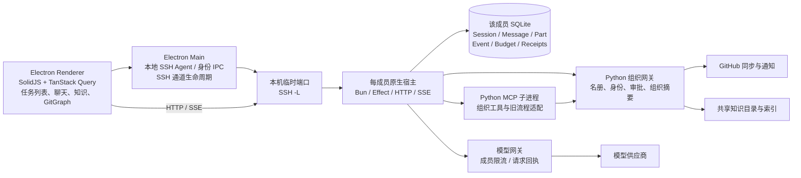

# QuantCode 架构、内存与并发审计

日期：2026-09-13。范围：当前桌面版本、Server C 实际部署，以及与任务执行、身份、知识、GitHub 相关的代码。界面点击验收由用户执行；本轮使用进程数据、浏览器 CPU/堆分析、真实宿主只读 API、源码和回归测试。

## 1. 结论与处理状态

|问题|证据与判断|状态|
|桌面内存过高、操作卡顿|Git 图谱在响应式 memo 内进行大量重复读取；隐藏的 GitHub 页面仍创建全部仓库图谱。堆保留链已定位到 `CommitGraph`|已修复这两个明确原因，完成测试、构建和重启|
|点击任务不能进入对话|任务索引及三个任务的 session GET 均为 200；现场桌面请求的 `127.0.0.1:48199` 无 SSH 监听，SSE 反复连接拒绝。任务路由依赖该通道读取 session/目录，连接失败缺少完整的恢复与反馈链路|确认现场断链；重启已恢复通道。自动恢复和入口状态机仍需 P0 重构，未宣称 GUI 问题彻底解决|
|服务器常驻成本高|56 个原生宿主服务：37 个成员/管理员宿主，另有 19 个旧 e2e 模拟宿主|完成分组计量；未停止或删除任何旧宿主数据|
|预算停住|之前已确认标题请求占并发、对话 429 被保留为未知用量。已用回执结算修复|已完成，详见任务连续对话修复报告；这不是 Redis 锁或数据库死锁|
|Redis|当前产品执行链无 Redis 客户端依赖；Server C 没有运行 redis-server|不是本次故障来源，不建议把引入 Redis 当作当前修复|
|经典死锁|采样时管理员无活动任务、无遗留任务/预算锁，服务器无当前内存/IO 压力；源码具有短状态锁与长写入锁两类机制|没有现场证据证明 ABBA 死锁。存在崩溃后永久租约、持锁跨网络调用、等待缺少观测等风险|

## 2. 当前真正运行的架构



另有本机 sidecar 供应用启动、兼容功能使用。它不是 Server C 的任务宿主，两者的项目路径、身份与可用性不能混用。

### 一个任务如何执行

当前桌面 SDK 的 `/session/:id/prompt_async` 调用 `SessionPrompt.prompt`，写入用户消息后进入 `SessionRunState.ensureRunning` 和 `effect/Runner`，再由 `SessionPrompt.run`、工具注册器和 `LLM.stream` 执行。消息、部件、预算和写入回执进入同一成员数据库；SSE 把变化推到桌面。

这里需要纠正文档与实现的一个重要差异：仓库另有 Core v2 的 `SessionExecution`、`SessionRunCoordinator`、`SessionRunner` 和 durable input 路线，但当前上述桌面入口仍调用 `SessionPrompt`。不能把另一条 Core v2 路线已有的队列保障，直接当成当前桌面聊天已经具备的能力。重构时必须明确唯一入口和迁移边界，不能继续叠加第三套调度器。

旧 Python LangGraph、checkpoints、`run_agent` 及 trace 投影是另一组兼容实现。原生工作台已经承担主对话，应逐项减少旧页面对旧执行结果的依赖，保留历史数据读取，避免新功能再次只能在其中一套流程显示。

主要源码：`frontend/packages/opencode/src/server/routes/instance/httpapi/handlers/session.ts:327`、`src/session/prompt.ts:1149`、`src/session/run-state.ts:180`、`src/effect/runner.ts:118`；Core v2 对照为 `frontend/packages/core/src/session/execution/local.ts:16`。

## 3. 内存与 CPU：已复现的主要问题

### 桌面堆保留链

修复前 Renderer RSS 约 985 MiB；一次诊断性 GC 后 JS 堆仍约 805.6 MiB。6 秒空闲 CPU 采样主要是 idle，没有持续 CPU 满载，卡顿应重点关注同步计算突发和高保留内存。

堆快照包含约 197 万个节点、740 万条边。数组自身占约 768 MiB。最大的两个数组各 207,283,980 字节，合计约 395.4 MiB，引用链为：

```text
CommitGraph 闭包（rowHeight / page / rows / height）
  → graph memo
  → Solid computation
  → sources / sourceSlots
  → 两个各约 198 MiB 的数组
```

这至少把 395 MiB 的保留明确定位到 Git 图谱的响应式依赖记录，不能归因于模型上下文、Redis 或研究数据过大。

`layoutGitGraph` 直接接收 Solid store 中的 commit/head 对象，在排序比较、每轮队列排序、逐提交匹配所有分支时反复读取属性。响应式框架记录了大量重复依赖。`GitHubWorkspace` 又只通过 CSS 隐藏自己，即使停留在“我的任务”页，也会创建 `RepositoryGraph` / `CommitGraph`。

### 本轮已落地的修复

1. 在布局函数边界将每个字段读入普通数据快照，排序与关联不再重复读取响应式代理。
2. 预先建立分支索引、解析日期；拓扑队列改为插入有序位置，避免每取一个节点就重新排序全部队列。
3. GitHub 页面不可见时不挂载仓库图谱。通知状态与数据缓存保留，不删除功能。

修改：`frontend/packages/app/src/components/quantcode/git-graph-layout.ts:5`、`github-workspace.tsx:135`；回归：`git-graph-layout.test.ts:27`。

|指标|修复前|修复后|
|---|---:|---:|
|基准数据|1000 commits / 100 heads|相同|
|提交字段读取次数|3,105,424|4,000|
|分支字段读取次数|100,002|200|
|布局中位耗时，7 次|83.87 ms|0.76 ms|
|首页空闲 JS 堆|约 805.6 MiB（GC 后）|约 16.2 MiB（新版本重启后）|
|首页 DOM 节点|9,445|1,004|
|Renderer RSS|约 985 MiB|约 133 MiB|

算法基准不能换算成整机提速倍数。首页内存对照包含按需挂载和重启效果，不能据此宣称长时间使用、多窗口、大仓库详情的所有内存风险都已解决。

### 仍需规划的缓存边界

- Global 为所有保存的服务器提前创建 context；每个 context 又有 SDK、QueryClient、SSE 和目录/会话缓存。应先按“正在使用的服务器”激活连接，而不是把所有历史连接长期激活。
- 目录缓存上限 30、闲置 TTL 20 分钟；淘汰主要由访问/解除 pin 触发，TTL 并不意味着到时必然自行清理。
- 消息缓存 40 个会话、info 缓存 2048 条；活动/被 pin/等待审批的会话会被保护。数量上限无法约束单个大结果、附件、diff 的字节量。
- tab memory 直到关闭标签才 dispose。需要建立每个 server / session / tab 的内存观测及重结果字节预算，而不是统一粗暴清缓存。

## 4. 点击任务：连接身份与视图状态没有收口

### 现场检查

三项任务从独立、真实 SSH 通道读取 `session.get` 均返回 200，目录都是 `/srv/quant/users/quantadmin`，分别约 321 / 263 / 267 ms；任务索引约 593 ms。这说明任务数据、任务 ID 和目录映射可以读取。

与此同时，桌面 SSE 仍请求 `http://127.0.0.1:48199/global/event` 并收到 `ERR_CONNECTION_REFUSED`，本机该端口没有监听的 SSH 进程。重启后一度恢复了本机监听，实际 publication 请求重新返回 200；收尾检查时又未发现该端口监听，因此重启不能作为长期修复。现有实现丢弃 SSH stderr，无法仅凭这些记录还原子进程退出原因，需补充退出原因与连接状态通知。

没有保留下用户点击那一刻的完整前端异常栈，因而不能断言所有“点击无反应”只有一个原因。当前证据已经足够确定：通道状态和界面状态存在脱节，路由的等待/报错路径也缺少明确的恢复入口。

### 结构问题

- `openResearchTunnel` 创建 SSH 子进程，提供 `alive()` / `stop()`；进程退出后的自动重建、重连退避、连接代次通知没有形成统一机制。keepalive 能发现失联，不能完成恢复。
- frontend server key、tab key、SDK URL 与本机端口紧耦合；端口被占用时会换成随机端口。逻辑上同一台宿主可能被当成另一台服务器，旧标签或缓存仍指向旧地址。
- `ResolvedTargetSessionRoute` 需先取得 session lineage 和目录，再挂载会话。外层 Suspense 和无统一 deadline 的请求会把运输层故障表现为页面等待；不能把“没有返回”当作“用户没点到”。
- 连接失败、会话过期、任务不存在、任务执行中是不同状态，目前散落在 health、身份 IPC、Panel、server SDK、route resource 中。

### P0 重构目标

引入一个由 Main 管理的连接记录，复用已有 SSH 模块：

```text
逻辑宿主 ID（稳定）
  ├─ 身份：actor / group / session / expires_at
  ├─ transport：connected / reconnecting / offline
  ├─ 当前 URL + generation
  └─ 当前任务 ID + 已授权工作目录
```

Main 负责重连和有界退避；Renderer 消费状态变化并中止旧 generation 的请求。有效身份下重建通道不应重新创建任务；身份过期时进入现有两步登录。每次任务打开都立刻显示“打开中/重连中/需要登录/失败重试”，为元数据读取设 deadline，并只在确证不存在时移除标签。短暂断线不清空任务记录，不创造新 session。

这次没有把上述跨层重构混进内存修复。它是下一项最高优先级工作。

## 5. 服务器常驻实例与资源

Server C 采样：总内存约 92.3 GiB，可用约 21 GiB；swap 使用约 1.9 GiB。连续采样的 swap in/out 为 0，CPU idle 约 84%，memory/IO PSI avg10 为 0。不能仅凭 swap 已使用就认定当前正在换页抖动，也没有依据把本次卡顿直接归因为服务器整体负载耗尽。

|实例分类|数量|cgroup memory.current 合计|cgroup tasks 合计|
|---|---:|---:|---:|
|成员/管理员原生宿主|37|11,257.2 MiB|227|
|旧 e2e 模拟宿主|19|5,515.6 MiB|418|

`memory.current` 含该 cgroup 计费的内存与缓存，不等于纯应用堆；实际停止后的回收量需另测。部分模拟账号同时保留多个 `e2e-20260909-*` 版本，缺少测试结束回收机制。

建议先核对旧测试实例是否仍有执行/未完成回执，再停止其常驻与自动启动，保留 DB、回执和产物。测试部署应登记 owner、run ID、结束时间，统一执行清理。正式成员仍保留 Linux 账号隔离，可采用按需启动和闲置停止；有执行、终端、待处理产物或交互请求时不得停机。不要为节省内存把所有成员合并进一个不隔离的全权限进程。

## 6. 并发与锁：不同机制要分别治理

|机制|作用域/实际实现|现有保障|风险与优化点|
|---|---|---|---|
|会话 Runner|当前 Instance 中按 Session ID 的 Map；Effect SynchronizedRef + Fiber/Deferred|同一任务已有执行时加入等待；不同任务可并发|进程重启后的运行协调是另一回事，不能把进程内 Map 当 durable queue|
|取消 fence|进程内 epochs/active 与任务祖先关系|停止期间拒绝旧 admission，先停止父任务再核对后代|需要观测取消与 finalizer 的耗时，并限制元数据常驻增长|
|原生写入锁|根任务 key；文件系统目录租约|父子任务写入串行；约 5 秒获取超时|非可重入；跨进程要保持固定锁序；网络或工具执行延迟会放大等待|
|预算锁|根任务 key；与写入锁分开|只在 reserve/settle/review 时锁定，模型流不持该锁|部分临界区内仍进行身份网络验证与全量事件重放；应缩小持锁工作并保留授权复核|
|文件租约恢复|metadata 含 token/pid/hostname；QuantCode 使用无限 staleMs|避免按 TTL 偷走一个仍可能写入的执行|崩溃可能留下僵尸租约；不能只凭 PID 存在判断是不是原进程，建议纳入 boot ID / process start time|
|旧 Python 执行锁|`fcntl.flock`，每 checkpoint/thread|内核在进程退出时释放，不 unlink 锁文件|与原生租约的恢复语义不同，不能给用户同一套含糊提示|
|SQLite|每宿主 WAL + FULL synchronous + busy_timeout 5000|写入 admission/receipt 的持久性|单 writer 争用需监测；不要为了速度把有外部副作用的事件改为不可靠写入|
|模型网关|Python Lock 保护并发计数，BoundedSemaphore 限制 HTTP workers|管理员 2 全局/1 每成员；成员 4 全局/2 每成员；finally 释放|目前是拒绝重试而不是公平队列；所有重试需明确是否已执行和实际用量|

源码核对中，Runner 将等待、interrupt 等操作放在 `SynchronizedRef.modify` 返回之后执行，不能把存在 `SynchronizedRef` 本身认定为死锁。当前也未发现需要立即修复的确证 ABBA 环。

仍需要建立锁观测：`root/session/request ID、lock key、holder、wait_ms、held_ms、phase、取消原因`。禁止记录私钥、token 或完整模型提示词。统一临界区顺序，禁止持有根任务写入锁等待子任务再次取得同一个根锁；禁止持数据库事务等待网络调用。对于未知外部结果，应区分“执行结束但待核对”和“进程仍持锁”，不要都叫忙碌。

当前观察到的管理员 DB 仅 4 sessions / 16 messages / 39 parts / 249 events，锁目录为空，执行状态为空。这不支持“海量数据库数据或已发生死锁导致本次点不开”的判断。

## 7. 身份验证、数据库投影和后台轮询

### 身份重复验证

`currentIdentity()` 每次读取私有凭据、请求组织网关 `/session`，再复核凭据文件。`gatewayRequest()` 前后多次调用它。Runner watchdog、LLM watchdog 和任务 publisher 均有 2 秒循环；列表、工具、文件操作还分别校验。Python 网关 session 查询再次读取 SQLite、解析名册并核验权限。

这些校验承担真实的账号隔离和撤权，不能直接删掉。优化顺序：同一 credential generation 的并发请求合并；一次操作内传递内部授权上下文；名册解析缓存绑定文件版本并在变更时失效；写入与最终结果释放前仍做必需复核。不要把一个长 TTL 的 Redis 身份缓存当作执行授权。

### 事件账本重放与列表 N+1

预算、intent、reuse 等模块从 Event 重建状态。任务列表对每个 session 生成完整 summary，又核对 budget、solution、产物与授权；publisher 每 2 秒检查状态、约每 30 秒扫描，生成 detail 后才判断 revision 是否已交付。

建议将账本保留为真值，增加同事务更新的预算/任务摘要投影；按 `(session_id, revision)` 缓存只读结果，使用批量摘要查询。publisher 应先比较 revision，再生成昂贵的完整快照；无脏数据时退避，失败使用有界重试。不得把缺失投影误展示成任务丢失，必须能从事件恢复。

当前 SQLite `cache_size=-64000` 是每连接约 64 MiB 的缓存上限，不代表启动就全部占满。减少连接与常驻实例比盲目更换数据库更优先。FULL 持久化保障保留；应测量事务耗时、busy 等待、WAL 增长和 checkpoint 时间后再调参。

### 控制面的并发边界

模型网关有 HTTP worker 上限，身份网关直接使用 `ThreadingHTTPServer`。随着后台验证和成员数量增长，后者需要并发上限、请求 deadline、队列指标，以及明确信号区分 401/403、429、503。前端 TanStack 重试、工具层 retry、SSE 内层重试与外层 reconnect 也应统一预算，避免叠加造成请求风暴。

## 8. Redis 的实际位置与适用边界

当前产品链路没有使用 Redis。仓库中的 `@upstash/redis` 位于 `frontend/packages/console/app/src/routes/zen/util/`，服务另一套控制台的限流和费用批处理；投资人材料生成器中还有 Redis/PostgreSQL 的架构描述，不能据此断定现有 QuantCode 已经部署它们。

当前优先修复前端计算、SSH 生命周期、常驻测试宿主和本地投影。Redis 对这些问题不是直接解法。

当后续确实需要多个控制面/模型网关副本共享限流，或者跨节点消费非权威通知时，可以评估 Redis。若引入，应明确：消息允许丢失与否、消费重试/幂等、故障降级、持久性、与 SQLite/其他数据库的真值关系。它不能替代模型实际用量回执，也不能凭租约 TTL 保证外部写入 exactly-once。跨宿主执行需要 durable admission、任务归属、fencing 与回执协议共同设计。

## 9. 建议的重构顺序与验收任务

|优先级|具体交付|验收标准|
|---|---|---|
|P0，已做|Git 图谱普通数据快照、减少排序/关联重复工作、隐藏时卸载图谱|已通过 675 项前端测试及专门的依赖读取上界测试；大仓库页面切换由用户验收|
|P0，下一项|稳定逻辑宿主 ID + Main 通道管理 + 连接代次 + 任务入口状态机|点任务立即给出状态；有效登录下断线恢复仍回原 session/目录；端口变化不丢标签；失败有重试和明确原因|
|P1|清理旧 e2e 常驻服务、测试部署结束回收、正式宿主按需启动|正式任务不中断，历史数据保留；记录释放前后内存和恢复启动耗时|
|P1|身份并发请求合并、名册解析按版本缓存、控制面 HTTP 并发上限|减少 `/session` 请求放大；撤权、切组、退出登录仍即时阻止执行|
|P1|任务与预算投影、revision 优先的 publisher、批量摘要|列表工作量不随完整历史线性重放；投影损坏可重建；旧任务不消失|
|P1|锁等待/持有时间、队列长度、模型 admission/结算统一观测|能区分活跃请求、锁等待、未知用量与僵尸租约；取消操作有可解释的结束状态|
|P2|明确当前 SessionPrompt 与 Core v2 调度迁移，逐步退役旧执行/UI适配|只有一条新任务执行入口，兼容层只读历史；输入丢失/重复提交/重启恢复有协议级测试|
|P2|server/session/tab 按需激活及字节预算，超大图谱再评估 worker/服务端布局|长时间切换任务与页面后内存有上界，后台窗口不重复全量渲染|

用户验收集中在三件事：点击已有任务能否进入并看到原目录；同一任务连续对话是否保持 ID 和历史；访问 GitHub 后回到任务页是否仍顺畅。诊断、构建与必要测试由代码侧完成，不再把长时间自动点击作为验收前置条件。

## 10. 证据与限制

本地证据保存于 `.quantcode/`：`task-read-audit-20260913.json`、`server-runtime-audit-20260913.json`、`runtime-profile-20260913.json`、`runtime-profile-20260913-gc.json`、`runtime-profile-20260913-after.json`、`heap-summary-20260913.json`、`heap-retainers-20260913.json`、`graph-benchmark-20260913.json`。原始堆快照仅本地保存，权限 0600，不提交或外传。

本轮修改了图谱布局、图谱挂载条件与对应测试，未改任务数据库、身份授权规则、预算上限、服务器隔离和后台宿主启停策略。桌面类型检查、构建与 675 项前端单元测试通过，修复已运行。任务点击完整 GUI 回归与长期交互验收由用户执行；自动重连架构尚未落地。
